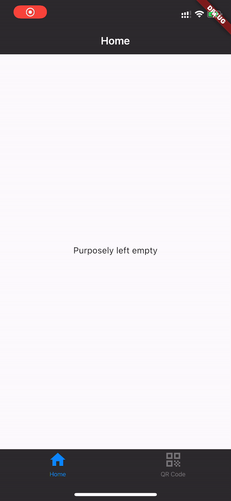

# Flutter - Generate QR code for string from server

## Result

As shown in the picture below, a QR code is generated from a random string retrieved from server. User can click the "Generate a new QR code" button to re-generate the QR code with a new random string from server.



## Server

The server is developed using Java + Sprint Boot

The following code builds a simple web app, which can return a random string when called

```java
@GetMapping("/randomString")
	public String randomString(String name) {
		String randomString = randomStringGenerator();

		return String.format(randomString, name);
	}

	public String randomStringGenerator() {
		String chars = "0123456789ABCDEFGHIJKLMNOPQRSTUVWXYZabcdefghijk" + "lmnopqrstuvwxyz!@#$%&";
		Random rnd = new Random();

		int len = 10;
		StringBuilder sb = new StringBuilder(len);
		for (int i = 0; i < len; i++)
			sb.append(chars.charAt(rnd.nextInt(chars.length())));
		return sb.toString();
	}
```

## Front end code

The frond end is developed using Flutter

**Code for building widgets**

```dart
Widget build(BuildContext context) {
    return MaterialApp(
      home: DefaultTabController(
        length: 2,
        child: Scaffold(
          appBar: AppBar(
            bottom: TabBar(
              tabs: [
                Tab(icon: Icon(Icons.home)),
                Tab(icon: Icon(Icons.qr_code)),
              ],
            ),
            title: Text('Interview Task'),
          ),
          body: TabBarView(
            children: [
              Scaffold (
                body: Center(
                  child: Text('Purposely left empty')
                )
              ),
              Scaffold (
                body: Center(child: Column(children: <Widget>[  
                  Container(  
                    margin: EdgeInsets.all(10),  
                    child: QrImage(
                      data: qrContent,
                      version: QrVersions.auto,
                      size: 300,
                      gapless: false,
                    )
                  ),
                  Container(
                    margin: EdgeInsets.all(10),
                    child: Text("String in the QR code: " + qrContent),
                  ),
                  Container(  
                    margin: EdgeInsets.all(10),  
                    child: FlatButton(  
                      color: Colors.blue,
                      highlightColor: Colors.blue[700],
                      colorBrightness: Brightness.dark,
                      splashColor: Colors.grey,
                      child: Text("Generate a new QR code"),
                      shape:RoundedRectangleBorder(borderRadius: BorderRadius.circular(20.0)),
                      onPressed: _generateNewQRCode,  
                    ),  
                  ),
                ])) 
              ),
            ],
          ),
        ),
      ),
    );
  }
```

**Code for retrieving random string from server**

```dart
_generateNewQRCode() async {
    print('retrieving a new random string from server');

    var url = 'http://192.168.1.10:8080/randomString';
    final response = await http.get(url);

    if (response.statusCode == 200) {
      print('new random string ' + response.body);
      setState(() {
        qrContent = response.body;
      });
    } else {
      print('fail to retrieve random string');
    }
  }
```

Kindly note that: in my testing, the server is deployed on a local machine. If you want to test the code, please replace the url with the address of your machine in the local network. 

